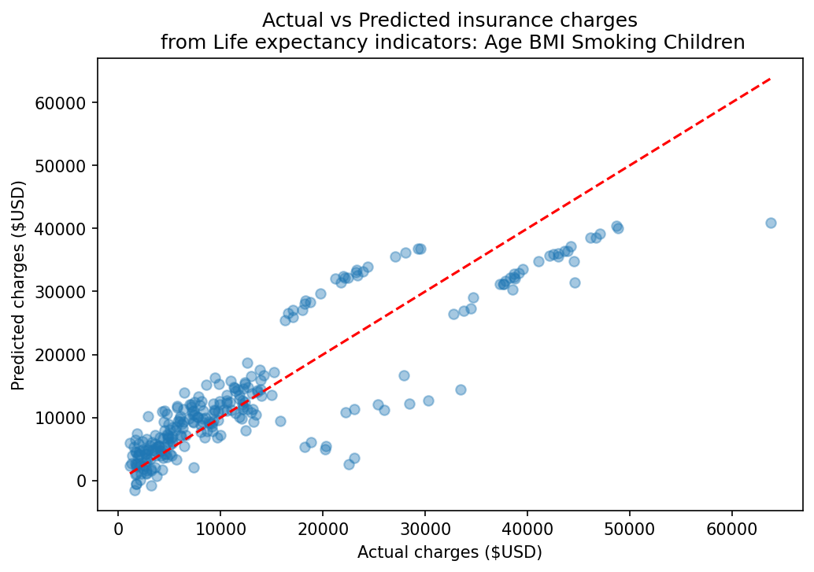

# Actual vs. Predicted Life Insurance Costs
A machine learning project that predicts health insurance charges based on personal attributes like age, BMI, smoking status, and number of children.
---

## What This Project Does
This model takes in basic information about a person in the US and predicts how much they may pay in life insurance charges. It was built using linear regression a  method that finds relationships between variables.

---

## Results
| Metric | Value |
|---|---|
| R² Score | 0.781 |
| Mean Absolute Error | $4,214 |

The model explains 78% of the variation in insurance charges. On average, predictions are off by $4,200.

---

## What Drives Insurance Costs?
| Factor | Effect on Cost |
|---|---|
| Smoking | +$23,653 |
| BMI (per point) | +$328 |
| Age (per year) | +$257 |
| Number of Children | +$427 per child |

Smoking is by far the biggest factor it adds over $23,000 to predicted charges compared to non-smokers.

---

## Files
| File | Description |
|---|---|
| `insurance.csv` | Dataset (1,338 records from Kaggle) |
| `insurance_model.py` | Main Python script |

---

## Source of Data
[Insurance Cost Personal Dataset — Kaggle](https://www.kaggle.com/datasets/mirichoi0218/insurance)

---
## Chart

---

# Built With
- Python
- pandas
- matplotlib
- scikit-learn
